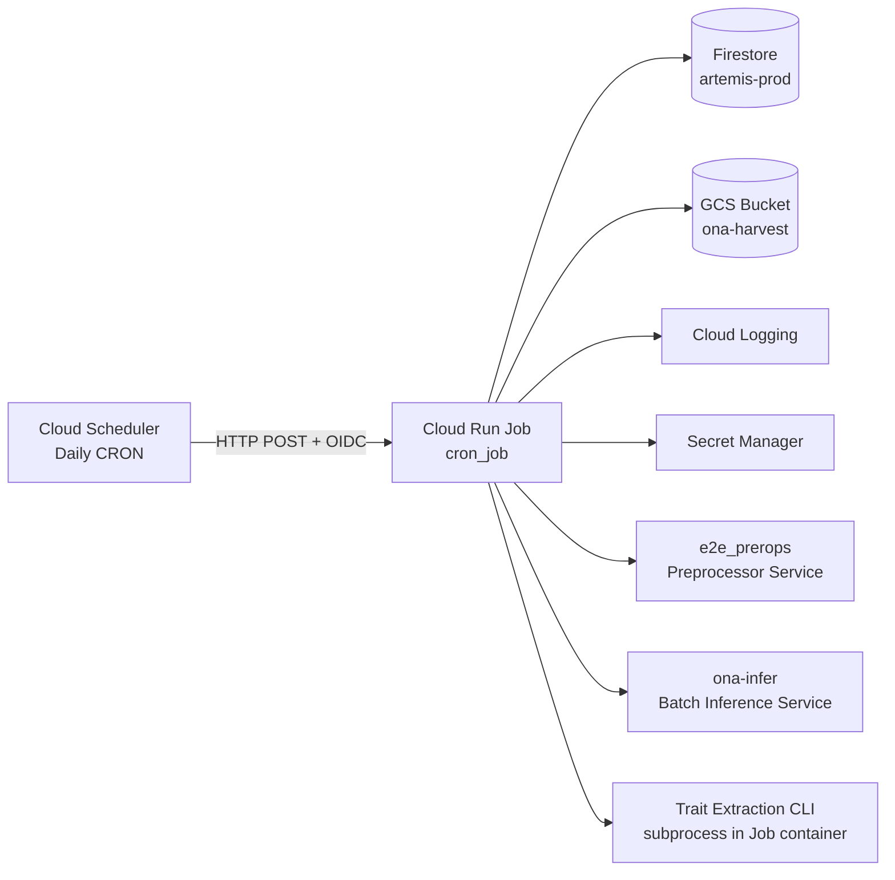
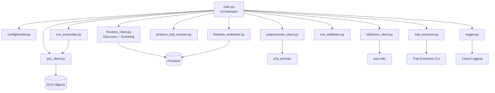
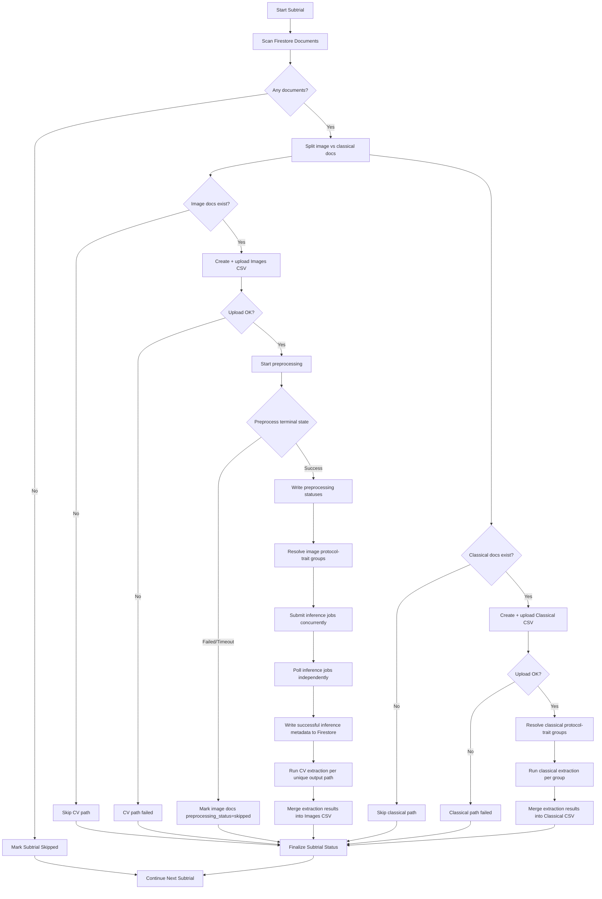
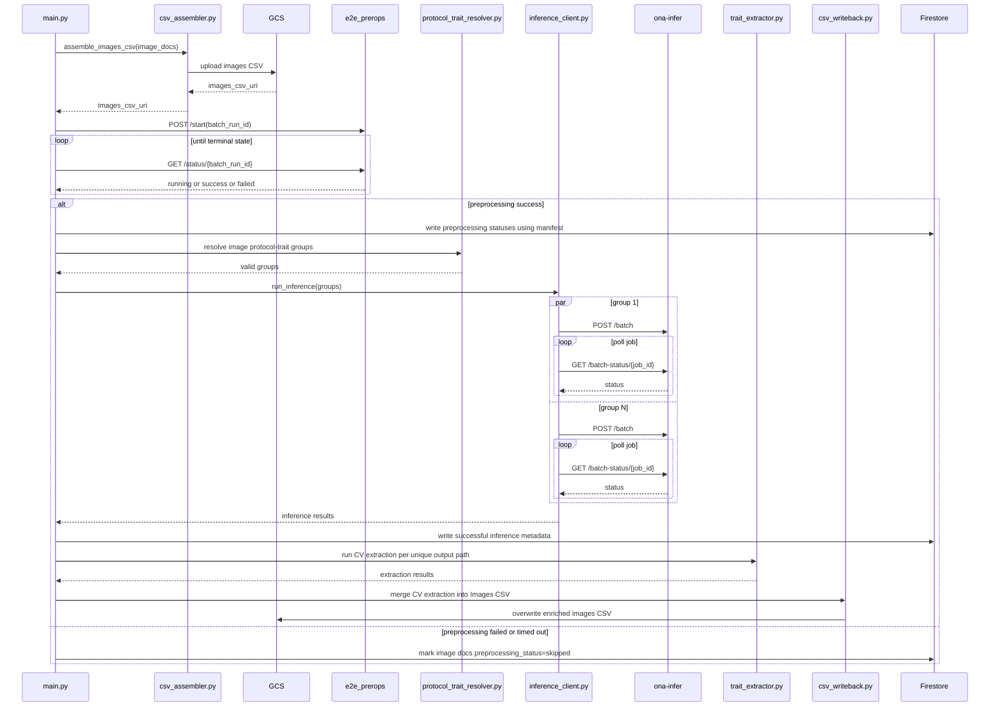
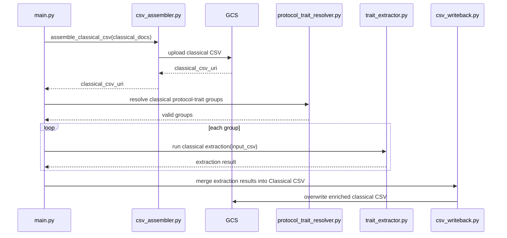
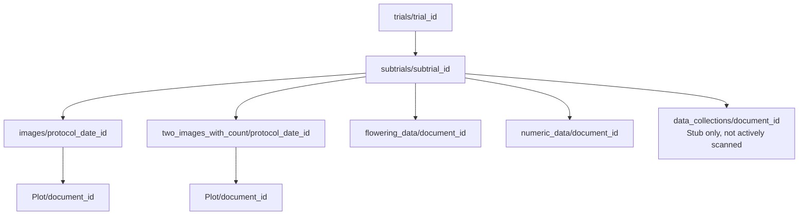

# Daily Pipeline Cron Job - Mermaid Diagrams

## 1. System context

## 2. Component architecture

## 3. Per-subtrial orchestration

## 4. CV path sequence

## 5. Classical path sequence

## 6. Firestore logical model

