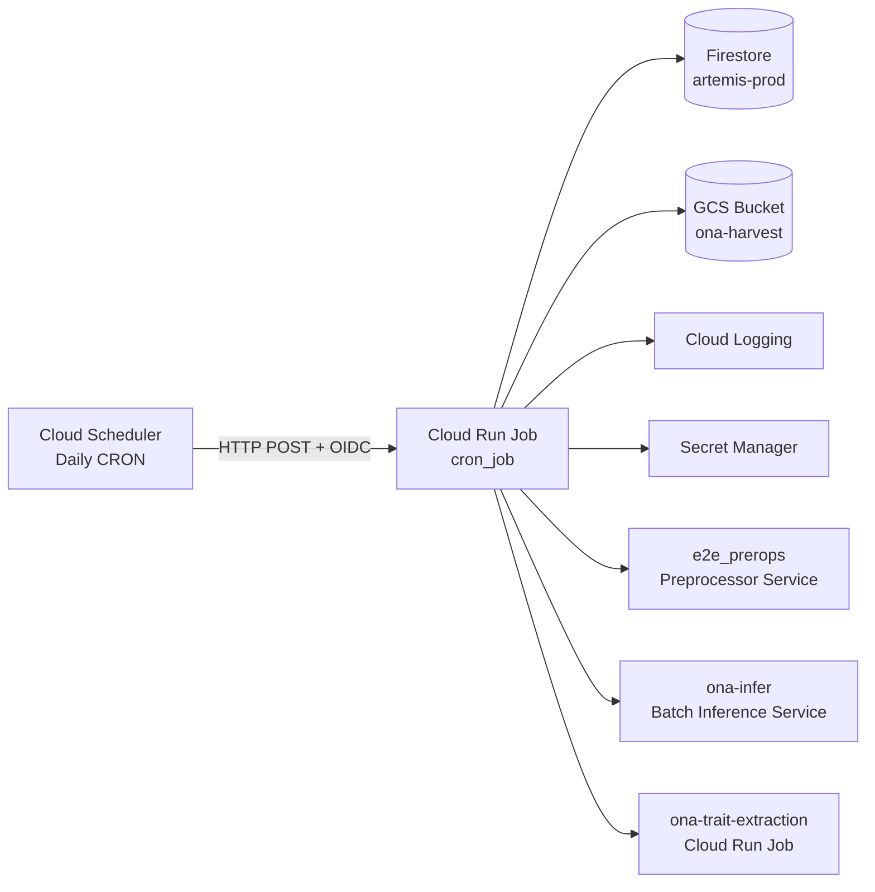
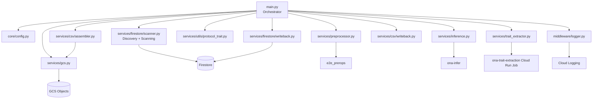
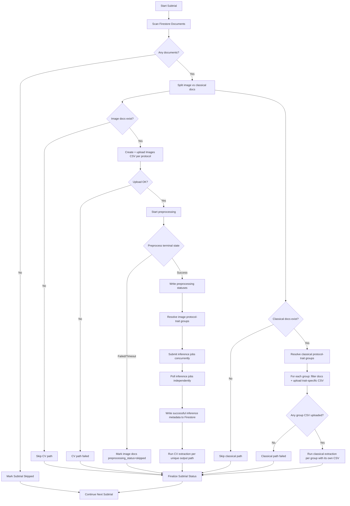
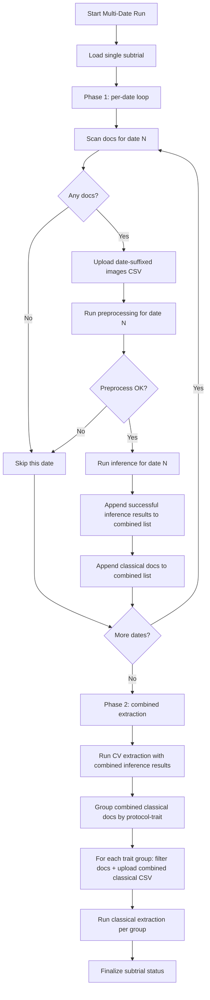
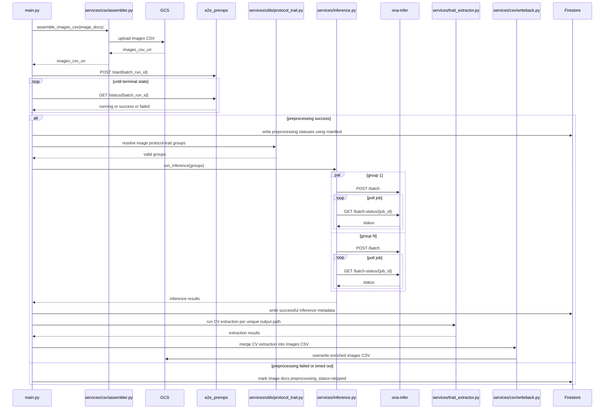
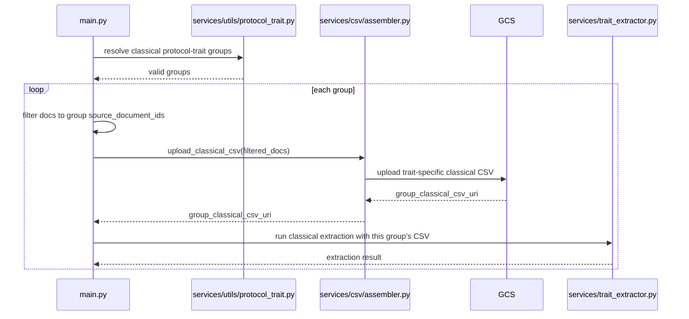
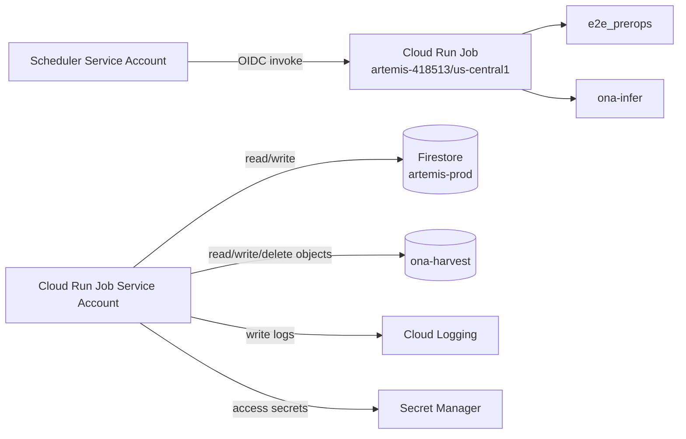

# Daily Pipeline Cron Job
## Consolidated High-Level Design, Low-Level Design, Architecture, and Data Schemas

**Document role:** implementation-grade design baseline for the `cron_job/` package.

**Source baseline:** consolidated from the provided requirements, design, and task plan. Where the three files disagree, this document normalizes the architecture around the more precise acceptance criteria and the more complete design flow.

---

## 1. Normalized Design Decisions

### 1.1 Decisions used in this design

| Area | Final design decision |
|---|---|
| Job exit code | `0` only when all processed subtrials succeed or no active trials exist. `1` when at least one subtrial fails or when a fatal bootstrap/discovery error occurs. |
| Batch run ID | `<run_id>-<subtrial_id>-images` for the Images CSV preprocessing path. In multi-date mode, batch IDs are date-suffixed: `<run_id>-<date_index>-<YYYY-MM-DD>`. |
| CSV model | Two CSVs per subtrial: `{subtrial_id}_images.csv` and **one classical CSV per trait group** (e.g. one for flowering, one for pods, one for plantstand). Single-CSV-for-all-traits is no longer supported because the downstream trait extraction service rejects mixed protocol/data_type CSVs. |
| Inference fan-out | Dynamic, driven by unique `(protocol, trait)` groups derived from image documents. Do not hardcode three inference jobs. |
| Classical fan-out | Dynamic, driven by unique `(protocol, trait)` groups derived from classical documents. Each group gets its own filtered CSV upload before extraction. |
| Date selection | Three mutually-relevant flags. Precedence: `--data-collected-dates` > `--data-collected-date` > `--run-date`. See section 2.5.1. |
| Multi-date mode | When `--data-collected-dates` is supplied, scan/csv/preprocess/inference run per-date in phase 1, then trait extraction runs once in phase 2 with combined inference results and per-trait classical CSVs covering all dates. |
| `data_collections` | Stub only. Function exists but returns `[]`; it is not actively scanned. |
| CSV leading columns | `collection_name`, `document_id`, `image_uri`, `protocol`, `trait`, followed by sorted dynamic metadata fields. |
| Firestore write-back | Best effort only. Write-back failures are logged but do not change subtrial status or job exit code. |
| Subtrial sequencing | Subtrials are processed sequentially. Within a subtrial, CV and classical paths are orchestrated independently; classical continues if CV fails and vice versa. |
| Group-level failures | The workflow continues attempting remaining groups. For operational correctness, this design recommends marking the subtrial as failed if any required protocol-trait group fails at inference or extraction, while still completing all remaining attempts and write-backs. |

### 1.2 Important contradictions and gaps resolved or flagged

1. **Exit code contradiction**
   - One source sentence says non-zero only when every subtrial fails.
   - The detailed acceptance criteria and system design state `1` when any subtrial fails.
   - This design uses **exit `1` on any subtrial failure**.

2. **Trait vocabulary contradiction**
   - The source materials use both:
     - Inference vocabulary candidates: `pod`, `flower`, `plant_stand`
     - Extractor vocabulary: `pods`, `flowering`, `plantstand`
   - This design keeps these as **separate mappings**, with one canonical resolver and explicit external service adapters. The exact `ona-infer` `trait_type` enum must be verified before implementation.

3. **Task plan drift**
   - The task plan contains stale entries that hardcode three traits and a single CSV path.
   - The correct architecture is dynamic protocol-trait grouping and two independent CSV/pipeline paths.

4. **Preprocessing Firestore write-back contract is underspecified**
   - Requirements demand per-document values: `selected`, `rejected`, `skipped`.
   - The current preprocessor result model only contains success/failure and batch ID.
   - A **selection manifest contract** is required from `e2e_prerops` to support precise Firestore write-back.

5. **Inference Firestore write-back contract is underspecified**
   - Requirements demand per-document `inference_output_json_path` and `annotated_img_path`.
   - The current inference result model only exposes a job-level output folder.
   - A **per-document inference output manifest** is required.

6. **Merge key risk**
   - CSV write-back joins on `document_id`.
   - Firestore document IDs are not necessarily globally unique across nested collections.
   - The safer long-term key is `source_document_path` or `collection_path`. This design keeps `document_id` to match the current requirements, but recommends adding `collection_path` to CSVs and result manifests immediately.

7. **Runtime budget risk**
   - Deployment requires a Cloud Run Job timeout of at least 28,800 seconds, but the workflow processes subtrials sequentially and a single subtrial can spend up to 1 hour preprocessing plus up to 2 hours on inference polling, excluding extraction and I/O.
   - Many subtrials can exceed the job budget. Capacity limits, sharding, or a future queue-based architecture should be considered.

---

# 2. High-Level Design

## 2.1 Purpose

The Daily Pipeline Cron Job is a scheduled GCP batch orchestrator that:

- Discovers active trials and active subtrials from Firestore.
- Finds documents uploaded during the current UTC date.
- Splits data into:
  - **Images path** for computer vision processing.
  - **Classical path** for structured phenotyping extraction.
- Produces raw CSVs in GCS.
- Orchestrates preprocessing, inference, extraction, and CSV enrichment.
- Writes selected operational metadata back to Firestore image documents.
- Emits structured Cloud Logging events for traceability and alerting.

## 2.2 Goals

- **Traceability:** every execution has a unique `run_id`.
- **Determinism:** same input document set produces stable CSV header ordering and predictable artifact paths.
- **Isolation:** one failed subtrial does not block later subtrials.
- **Pipeline independence:** CV and classical paths do not block each other.
- **Observability:** all material state transitions are logged with machine-queryable JSON.
- **Security:** no hardcoded secrets; service identities and Secret Manager are used.
- **Operational recoverability:** artifacts are scoped by `run_id` to preserve history.

## 2.3 Non-goals

- This job does not replace the existing preprocessor, inference service, or trait extraction Cloud Run Job.
- This job does not own ML model lifecycle, model versioning, or training.
- This job does not provide an end-user UI.
- This job does not persist a canonical pipeline run registry in Firestore unless the optional audit schema is added.
- This job does not guarantee global idempotency across repeated runs for the same UTC date unless additional deduplication controls are added.

## 2.4 Core actors and systems

| Actor/System | Responsibility |
|---|---|
| Cloud Scheduler | Triggers the Cloud Run Job daily via authenticated HTTP request. |
| Cloud Run Job | Executes the orchestration logic. |
| Firestore | Stores trials, subtrials, source documents, and image-document write-back fields. |
| GCS bucket `ona-harvest` | Stores raw CSVs, inference artifacts, extraction outputs, and optionally manifests. |
| `e2e_prerops` | Preprocesses image CSV data and determines selected/rejected/skipped images. |
| `ona-infer` | Runs asynchronous batch inference jobs for unique image protocol-trait groups. |
| Trait extraction Cloud Run Job (`ona-trait-extraction`) | Produces derived trait outputs for CV and classical paths. Invoked via the Cloud Run Jobs API with an inline run-spec. |
| Cloud Logging | Stores structured run, stage, and failure logs. |
| Secret Manager | Supplies runtime secrets where needed. |

## 2.5 High-level execution flow

1. Scheduler invokes the Cloud Run Job (or it is triggered manually with `gcloud run jobs execute`).
2. Job generates `run_id` before any environment validation.
3. Job loads configuration and initializes clients.
4. Job parses the date selection flag (see 2.5.1).
5. Single-date mode (default): Job discovers active trials and subtrials.
   - For each subtrial, sequentially:
     - Scan today's documents.
     - Split image vs classical documents.
     - Create and upload zero, one, or two CSVs (images + per-trait classical).
     - If an Images CSV exists:
       - Trigger preprocessing.
       - Poll until terminal state.
       - Write preprocessing state back to Firestore image docs.
       - Resolve protocol-trait groups.
       - Submit inference jobs concurrently, one per valid group.
       - Poll each job independently.
       - Write successful inference result metadata back to Firestore image docs.
       - Run CV extraction once per unique successful inference output path.
     - If Classical documents exist:
       - Resolve protocol-trait groups.
       - For each group, upload a filtered classical CSV containing only that group's documents.
       - Run classical extraction once per group with that group's CSV.
     - Record subtrial outcome.
6. Multi-date mode (`--data-collected-dates` supplied): Job loads the single supplied subtrial.
   - **Phase 1 (per-date, sequential):** For each date:
     - Scan documents matching that `data_collection` date.
     - Upload date-suffixed CV CSVs and run preprocessing + inference.
     - Accumulate successful inference results into a single combined list.
     - Accumulate classical documents into a single combined list.
   - **Phase 2 (combined, once):**
     - Run CV extraction with the combined inference results across all dates. Deduplication by `(canonical_trait, output_gcs_path)` is preserved.
     - Group the combined classical documents. For each trait group, upload one combined classical CSV (covering all dates) and run classical extraction with that group's CSV.
7. Emit final summary.
8. Exit `0` or `1` according to final outcome.

### 2.5.1 Date selection flags and precedence

Three flags are accepted. Precedence (highest first):

1. `--data-collected-dates` — multi-date mode, `+`-delimited list of `YYYY-MM-DD` values.
2. `--data-collected-date` — single date, filters Firestore by the `data_collection` string field.
3. `--run-date` — single date, filters Firestore by the `upload_timestamp` UTC window. Defaults to today when nothing else is supplied.

The `+` separator is required in `--data-collected-dates` because Cloud Run splits `--args` on commas. Internally `_parse_dates` accepts `+` or `;` as separators.

## 2.6 Processing topology

### 2.6.1 Subtrial-level behavior

- **Sequential across subtrials**
  - Predictable resource use.
  - Easier recovery and logs.
  - Possible throughput bottleneck for large numbers of subtrials.

- **Independent CV/classical path handling**
  - CV failure does not block classical processing.
  - Classical failure does not block CV processing.

- **Concurrent inference within one subtrial**
  - One async job per unique valid image protocol-trait group.
  - Independent polling for each submitted inference job.

- **Per-trait classical CSV uploads**
  - One CSV per `(protocol, trait)` group, filtered to that group's source documents only.
  - Required because the trait extraction service rejects CSVs containing mixed protocols or data types.

### 2.6.2 Multi-date topology

When `--data-collected-dates` is supplied:

- Phase 1 runs date-by-date sequentially. Each date executes scan, csv upload, preprocessing, and inference in isolation. A failure in one date is logged and the loop proceeds to the next date.
- Phase 2 runs once after phase 1 completes. CV extraction receives the combined list of successful inference results (deduplication via `seen` set is preserved). Classical extraction uploads one CSV per trait group with all dates' documents combined, then triggers extraction per group.
- Throughput benefit: downstream services (preprocessor, ona-infer) still see one date's payload at a time. Trait extraction sees the union, which is acceptable because it is the terminal step and benefits from batching.

### 2.6.3 Failure boundaries

| Failure type | Failure scope | Continue? | Affects job exit? |
|---|---|---:|---:|
| Missing env var | Entire job | No | Yes |
| GCP client init failure | Entire job | No | Yes |
| Discovery query failure | Entire job | No | Yes |
| One sub-collection scan failure | That collection only | Yes | Usually no, unless policy marks degraded scan as failure |
| One CSV upload failure | That pipeline path | Other path continues | Yes if subtrial considered failed |
| Per-trait classical CSV upload failure | That trait group only | Other trait groups continue | Subtrial path failure if all groups fail |
| Preprocessor failure | CV path | Classical continues | Yes |
| One inference group failure | That group | Remaining groups continue | Recommended yes |
| One extraction group failure | That group | Remaining groups continue | Recommended yes |
| One date in multi-date phase 1 | That date only | Remaining dates continue; phase 2 still runs with what succeeded | Subtrial succeeds if any date contributed extractable results |
| Missing classical metadata fields (`project_name`, `site_name`, `trial_name`, `season`, `field`, `location`) | Classical CSV upload returns `None` for that trait group | Other trait groups continue | Yes if all trait groups fail upload |
| Missing `data_collection` field on documents (in date-filter mode) | Documents silently excluded for that date | Yes | No crash; date may yield zero documents |
| CSV write-back failure | That pipeline path | Other write-back still attempted | Yes |
| Firestore write-back failure | Write-back only | Yes | No |

## 2.7 Deployment topology

- **Execution environment:** Cloud Run Job.
- **Deployment project:** `artemis-418513`.
- **Firestore project:** `artemis-prod`.
- **Region:** `us-central1`.
- **Scheduler:** daily CRON, example `0 2 * * *` UTC.
- **Task timeout:** at least 28,800 seconds.
- **Retries:** `0`.
- **Identity:** Cloud Run service account plus scheduler OIDC identity.
- **Cross-project access:** the Cloud Run Job service account must be granted suitable IAM permissions against Firestore in `artemis-prod` if the deployment project differs.

## 2.8 Security model

### 2.8.1 Authentication

- Prefer service account identity attached to the Cloud Run Job.
- The requirements allow fallback to service account key authentication.
- **Recommendation:** gate key fallback behind explicit configuration, or remove it in production. Key fallback increases credential exposure and operational risk.

### 2.8.2 Authorization

Minimum roles should cover:

| Service | Suggested minimum capability |
|---|---|
| Firestore | Read active trials/subtrials, read scanned documents, write selected image fields |
| GCS | Read/write/delete relevant objects in bucket `ona-harvest` |
| Cloud Logging | Write structured logs |
| Secret Manager | Access required runtime secrets |
| Cloud Run Invoker | Scheduler service account invokes job target |

### 2.8.3 Secret handling

- No API keys or URLs should be hardcoded.
- All secret material must come from Secret Manager or runtime environment injection.
- Log entries must not emit secret values.

---

# 3. Architecture Diagrams

## 3.1 System context diagram



## 3.2 Component architecture



## 3.3 Per-subtrial orchestration flow (single-date mode)



## 3.3.1 Multi-date orchestration flow



## 3.4 CV pipeline sequence



## 3.5 Classical pipeline sequence



## 3.6 Deployment and IAM view



---

# 4. Low-Level Design

## 4.1 Package structure

The current implementation uses a layered structure that groups files by responsibility. Empty placeholder modules from earlier scaffolding have been removed.

```text
cron_job/
|-- __init__.py
|-- main.py                          # CLI entrypoint, argparse, run() router
|-- Dockerfile
|-- cloudbuild.yaml
|-- requirements.txt
|-- core/
|   `-- config.py                    # AppConfig + load_config from environment
|-- db/
|   |-- firestore.py                 # Firestore admin client bootstrap
|   `-- gstorage.py                  # GCS client bootstrap
|-- middleware/
|   |-- logger.py                    # StructuredLogger emitting JSON to Cloud Logging
|   `-- logging.py
|-- schemas/
|   |-- models.py                    # Dataclasses: RunContext, SubtrialInfo, ScannedDocument,
|   |                                #             ProtocolTraitGroup, PreprocessorResult,
|   |                                #             InferenceJobResult, ExtractionRunResult, SubtrialState
|   |-- image.py
|   `-- plot.py
|-- services/
|   |-- gcs.py                       # GCS URI/bytes helpers
|   |-- preprocessor.py              # e2e_prerops HTTP adapter
|   |-- inference.py                 # ona-infer HTTP adapter (concurrent submission + polling)
|   |-- trait_extractor.py           # Cloud Run Job adapter for ona-trait-extraction
|   |-- csv/
|   |   |-- assembler.py             # CSV row/header assembly + raw uploads
|   |   `-- writeback.py             # CSV merge of extraction outputs onto raw CSV
|   |-- firestore/
|   |   |-- scanner.py               # Discovery + per-subtrial document scanning
|   |   `-- writeback.py             # Per-doc preprocessing/inference field writes
|   `-- utils/
|       `-- protocol_trait.py        # Trait keyword resolver and group assembly
|-- docs/
|   |-- daily_pipeline_design_pack.md
|   |-- daily_pipeline_mermaid_diagrams.md
|   |-- LOCAL_TESTING_AND_DEPLOYMENT.md
|   `-- PLAN.md
`-- tests/
    |-- conftest.py                  # CaptureLogger, app_config, doc/group fixtures
    |-- test_daily_pipeline_units.py
    |-- test_daily_pipeline_adapters.py
    |-- test_csv_assembler.py
    |-- test_csv_writeback.py
    |-- test_gcs_client.py
    |-- test_firestore_scanner.py
    |-- test_firestore_writeback.py
    |-- test_logger.py
    |-- test_trait_extractor.py
    |-- test_classical_path.py
    `-- test_multi_date_orchestration.py
```

Notes:
- A dedicated `errors.py` module is not used; the codebase relies on standard exceptions (`ValueError`, `RuntimeError`) and structured-logger `errors` payloads instead of custom exception classes.
- Stages live in `main.py` rather than a separate `stages/` package; the orchestrator was kept intentionally compact.

## 4.2 Configuration model

The actual `AppConfig` lives in `cron_job/core/config.py`. It is loaded from environment variables via `load_config(require_services=True)`.

```python
@dataclass(frozen=True)
class AppConfig:
    gcs_bucket: str
    preprocessor_url: str
    inference_url: str
    gcp_project_id: str
    firestore_database_id: str = "artemis-prod"
    gcp_run_region: str = "us-central1"
    trait_extraction_job_id: str = "ona-trait-extraction"
    trait_extraction_runs_collection: str = "trait_extraction_runs"
    firebase_storage_bucket: str = "artemis-418513.firebasestorage.app"
    raw_prefix_root: str = "raw"
    inference_prefix_root: str = "inference"
    extraction_prefix_root: str = "extraction"
    selected_images_bucket: str = "artemis-revamp"
    preprocessor_poll_timeout_s: int = 3600
    preprocessor_request_timeout_s: int = 30
    preprocessor_transient_error_limit: int = 5
    inference_poll_timeout_s: int = 7200
    inference_request_timeout_s: int = 60
    trait_extraction_poll_timeout_s: int = 24 * 60 * 60
    trait_extraction_request_timeout_s: int = 30
    inference_confidence: float = 0.5
    inference_limit: int = 1_000_000
    use_cloud_logging: bool = True
    firebase_credentials: dict[str, Any] | None = None
    gcp_service_account_credentials: dict[str, Any] | None = None
```

### Configuration principles

- Load from environment only.
- Validate at bootstrap.
- Generate `run_id` before config validation.
- Never emit secret values in logs.
- Consider loading only secret values from Secret Manager, while non-sensitive URLs and bucket/project names remain environment variables.

### CLI arguments (orchestrator entrypoint)

```python
parser.add_argument("--smoke-test", action="store_true")
parser.add_argument("--run-date", type=_parse_date, default=today)
parser.add_argument("--run-id", default=None)
parser.add_argument("--step", choices=STEP_CHOICES, default=None)
parser.add_argument("--trial-id", default=None)
parser.add_argument("--subtrial-id", default=None)
parser.add_argument("--limit-subtrials", type=int, default=None)
parser.add_argument("--image-csv-uri", default=None)
parser.add_argument("--classical-csv-uri", default=None)
parser.add_argument("--raw-prefix-root", default=None)
parser.add_argument("--batch-run-id", default=None)
parser.add_argument("--inference-output-dir", default=None)
parser.add_argument("--trait", default=None)
parser.add_argument("--data-collected-date", type=_parse_date, default=None)
parser.add_argument("--data-collected-dates", type=_parse_dates, default=None)
```

Date selection precedence (highest first):
1. `--data-collected-dates` (multi-date mode, `+`-delimited list)
2. `--data-collected-date` (single date, `data_collection` field filter)
3. `--run-date` (single date, `upload_timestamp` UTC window filter)

## 4.3 Core runtime models

### 4.3.1 Run context

```python
@dataclass
class RunContext:
    run_id: str
    utc_date: date
    bucket: str
    firestore_project_id: str
    preprocessor_url: str
    inference_url: str
    started_at: datetime
```

### 4.3.2 Subtrial discovery model

```python
@dataclass
class SubtrialInfo:
    trial_id: str
    subtrial_id: str
    trial_data: dict[str, Any]
    subtrial_data: dict[str, Any]
```

### 4.3.3 Scanned source document model

```python
@dataclass
class ScannedDocument:
    collection_name: Literal[
        "images",
        "two_images_with_count",
        "flowering_data",
        "numeric_data",
    ]
    document_id: str
    collection_path: str
    protocol_date_id: str | None
    image_uri: str | None
    protocol: str | None
    trait: str | None
    upload_timestamp: datetime
    fields: dict[str, Any]
```

**Notes**
- `collection_path` is recommended even if the current CSV join contract uses `document_id`.
- `protocol_date_id` is populated for image documents and `None` for classical documents.
- `fields` excludes duplicate canonical keys if the assembler already emits them as leading columns.

### 4.3.4 Scanning result model

```python
@dataclass
class SubtrialDocuments:
    image_documents: list[ScannedDocument]
    classical_documents: list[ScannedDocument]
    scan_errors: list[str] = field(default_factory=list)
```

### 4.3.5 Protocol-trait group model

```python
@dataclass
class ProtocolTraitGroup:
    protocol: str
    raw_trait_value: str
    canonical_trait_name: Literal["pods", "flowering", "plantstand"]
    inference_trait_type: str
    source_document_ids: list[str]
    source_collection_paths: list[str]
```

**Why retain document references in the group**
- Firestore inference write-back needs to know exactly which image docs correspond to a completed job.
- Without those references, the write-back module has to re-scan or re-resolve, which is avoidable and error-prone.

### 4.3.6 Preprocessor result model

```python
@dataclass
class PreprocessorResult:
    success: bool
    batch_run_id: str
    status: Literal["success", "failed", "timeout"]
    selection_manifest_uri: str | None = None
    error: str | None = None
```

### 4.3.7 Preprocessing write-back payload

```python
@dataclass
class PreprocessingWritebackPayload:
    document_id: str
    collection_path: str
    preprocessing_status: Literal["selected", "rejected", "skipped"]
    batch_run_id: str | None
    run_id: str | None
    timestamp: str
```

### 4.3.8 Inference job result model

```python
@dataclass
class InferenceJobResult:
    protocol: str
    raw_trait_value: str
    canonical_trait_name: Literal["pods", "flowering", "plantstand"]
    inference_trait_type: str
    success: bool
    job_id: str | None
    output_gcs_path: str | None
    result_manifest_uri: str | None = None
    source_document_ids: list[str] = field(default_factory=list)
    source_collection_paths: list[str] = field(default_factory=list)
    error: str | None = None
```

### 4.3.9 Inference write-back payload

```python
@dataclass
class InferenceWritebackPayload:
    document_id: str
    collection_path: str
    inference_job_id: str
    inference_output_json_path: str
    annotated_img_path: str
    run_id: str
```

### 4.3.10 Extraction result model

```python
@dataclass
class ExtractionResult:
    method: Literal["computer_vision", "classical"]
    canonical_trait_name: Literal["pods", "flowering", "plantstand"]
    success: bool
    output_prefix: str | None
    result_manifest_uri: str | None = None
    error: str | None = None
```

### 4.3.11 Subtrial execution state

```python
@dataclass
class SubtrialState:
    trial_id: str
    subtrial_id: str
    index: int
    batch_run_id: str
    status: Literal["pending", "succeeded", "failed", "skipped"]
    failed_stage: str | None = None

    image_document_count: int = 0
    classical_document_count: int = 0

    images_csv_uri: str | None = None
    classical_csv_uri: str | None = None

    cv_path_status: Literal[
        "not_applicable",
        "succeeded",
        "failed",
        "completed_with_errors",
        "skipped",
    ] = "not_applicable"

    classical_path_status: Literal[
        "not_applicable",
        "succeeded",
        "failed",
        "completed_with_errors",
        "skipped",
    ] = "not_applicable"

    preprocessing_writeback_count: int = 0
    inference_writeback_count: int = 0
    warnings: list[str] = field(default_factory=list)
```

## 4.4 Orchestration algorithm

### 4.4.1 Job-level pseudocode

```python
def run() -> int:
    args = parse_args()
    run_id = args.run_id or generate_run_id_utc()
    config = load_and_validate_config()
    clients = init_clients(config)
    logger = init_structured_logger(run_id, clients.logging)

    if args.smoke_test:
        return smoke_test(config, logger)

    if args.step and args.step != "full":
        return run_step(config, args, ...)

    # Multi-date mode short-circuits the discovery loop and processes
    # one explicitly-supplied subtrial across the supplied dates.
    if args.data_collected_dates:
        subtrial = load_subtrial_info(args.trial_id, args.subtrial_id)
        state = process_multi_date(
            config, ...,
            subtrial=subtrial,
            dates=args.data_collected_dates,
        )
        return 1 if state.status == "failed" else 0

    # Single-date mode (default) discovers active subtrials and processes
    # each sequentially.
    subtrials = select_subtrials(args, logger)
    states = []
    for index, subtrial in enumerate(subtrials, start=1):
        states.append(process_subtrial(
            config, ...,
            subtrial=subtrial,
            index=index,
            data_collected_date=args.data_collected_date.isoformat() if args.data_collected_date else None,
        ))
    summary = build_summary(states)
    return 1 if summary.failed > 0 else 0
```

### 4.4.2 Multi-date pseudocode

```python
def process_multi_date(config, *, subtrial, dates, ...) -> SubtrialState:
    state = SubtrialState(...)
    all_inference_results: list[InferenceJobResult] = []
    all_classical_documents: list[ScannedDocument] = []

    # Phase 1: per-date scan/csv/preprocess/inference
    for date_index, dc_date in enumerate(dates):
        try:
            docs = scan_subtrial_documents(..., data_collected_date=dc_date.isoformat())
            if not docs.image_documents and not docs.classical_documents:
                continue

            all_classical_documents.extend(docs.classical_documents)

            if docs.image_documents:
                csv_uris = upload_per_protocol_csvs(docs.image_documents, ...)
                preprocessing = run_preprocessing(csv_uris[0], batch_run_id=f"{run_id}-{date_index:03d}-{dc_date}", ...)
                if not preprocessing.success:
                    continue
                selected_docs = filter_to_selected(docs.image_documents, preprocessing)
                groups = group_documents_by_protocol_trait(selected_docs, ...)
                inference_results = run_inference(groups=groups, ...)
                successful = [r for r in inference_results if r.success]
                all_inference_results.extend(successful)
        except Exception as exc:
            logger.log_exception("multi_date_phase1", "failed", exc, ...)
            continue

    # Phase 2: combined CV + per-trait classical extraction
    if all_inference_results:
        run_cv_extractions(inference_results=all_inference_results, ...)

    if all_classical_documents:
        groups = group_documents_by_protocol_trait(all_classical_documents, ...)
        docs_by_id = {d.document_id: d for d in all_classical_documents}
        for group in groups:
            group_docs = [docs_by_id[did] for did in group.source_document_ids if did in docs_by_id]
            group_csv_uri = upload_classical_csv(documents=group_docs, ...)
            if group_csv_uri:
                run_classical_extractions(input_csv=group_csv_uri, groups=[group], ...)

    return state
```

### 4.4.3 Subtrial-level pseudocode (single-date mode)

```python
async def process_one_subtrial(...) -> SubtrialState:
    state = SubtrialState(...)

    logger.log(stage="subtrial_start", status="started", ...)

    docs = await scan_subtrial_documents(...)
    state.image_document_count = len(docs.image_documents)
    state.classical_document_count = len(docs.classical_documents)

    if not docs.image_documents and not docs.classical_documents:
        state.status = "skipped"
        logger.log(stage="subtrial_start", status="skipped", ...)
        logger.log(stage="subtrial_end", status="skipped", ...)
        return state

    # Independent CSV creation
    images_csv_uri = None
    classical_csv_uri = None

    if docs.image_documents:
        images_csv_uri = await create_and_upload_images_csv(...)
        state.images_csv_uri = images_csv_uri
        if not images_csv_uri:
            state.cv_path_status = "failed"

    if docs.classical_documents:
        classical_csv_uri = await create_and_upload_classical_csv(...)
        state.classical_csv_uri = classical_csv_uri
        if not classical_csv_uri:
            state.classical_path_status = "failed"

    # CV path
    if images_csv_uri:
        state.cv_path_status = await run_cv_path(...)

    # Classical path
    if classical_csv_uri:
        state.classical_path_status = await run_classical_path(...)

    # Terminal status
    if any_path_failed(state):
        state.status = "failed"
    else:
        state.status = "succeeded"

    logger.log(stage="subtrial_end", status=state.status, ...)
    return state
```

## 4.5 Firestore discovery and scanning LLD

### 4.5.1 Discovery

1. Query:
   - `trials.where("status", "==", "active")`
2. For each trial:
   - `trials/{trial_id}/subtrials.where("status", "==", "active")`
3. Return `list[SubtrialInfo]`.

### 4.5.2 Date filter modes

The scanner supports two filter modes:

**Upload-timestamp mode** (default, `--run-date`):

Use an inclusive/exclusive UTC window:

```python
start = datetime.combine(utc_date, time.min, tzinfo=timezone.utc)
end = start + timedelta(days=1)
query.where("upload_timestamp", ">=", start).where("upload_timestamp", "<", end)
```

**`data_collection`-string mode** (`--data-collected-date` or `--data-collected-dates`):

Filter on the `data_collection` string field using a prefix range:

```python
next_day = str(date.fromisoformat(target_date) + timedelta(days=1))
query.where("data_collection", ">=", target_date).where("data_collection", "<", next_day)
```

This matches values whose ISO-date prefix equals `target_date`. After the Firestore query, an in-memory check (`_matches_data_collection_date`) re-validates the prefix.

Documents missing `data_collection` are silently excluded in this mode. Documents missing `upload_timestamp` are silently excluded in upload-timestamp mode.

### 4.5.3 Classical scan

For each subtrial:

- Scan:
  - `flowering_data`
  - `numeric_data`
- Read `protocol` and `trait` directly from the document.
- Exclude documents without `upload_timestamp`.
- Preserve all original fields in `fields`.

### 4.5.4 Image scan

For each subtrial:

- Enumerate parent docs:
  - `images/{protocol_date_id}`
  - `two_images_with_count/{protocol_date_id}`
- Read `protocol` and `trait` from parent.
- For each parent, query nested:
  - `Plot/{document_id}`
- Filter by today's UTC upload window.
- Attach parent `protocol` and `trait` to each child plot document.

### 4.5.5 Scan error policy

- One failed collection query logs:
  - `stage = "scanning"`
  - `status = "error"`
  - `subtrial_id`
  - `collection_name`
- Continue the remaining scans.
- The final scanning log includes:
  - `image_document_count`
  - `classical_document_count`
  - recommended `document_count = image_document_count + classical_document_count`
  - optional `scan_error_count`

## 4.6 CSV assembly LLD

### 4.6.1 Header formation

Leading columns are fixed:

```text
collection_name,document_id,image_uri,protocol,trait
```

Then append dynamic Firestore fields:

- union of all field names across the document set
- sorted ascending
- exclude canonical columns already emitted as fixed fields

### 4.6.2 Missing field behavior

- Emit empty string when a document lacks a dynamic field.
- Preserve string values faithfully.
- Convert complex JSON-like values deterministically, e.g. compact JSON encoding, if they appear.

### 4.6.3 Recommended additional column

Add:

```text
collection_path
```

This is recommended for future-safe write-back and join accuracy. If strict compatibility requires the first five fields exactly as specified, append `collection_path` as the first dynamic field or treat it as a reserved post-fixed field.

## 4.7 GCS artifact model

### 4.7.1 Required path conventions

| Artifact | Path |
|---|---|
| Images raw CSV | `gs://ona-harvest/raw/{run_id}_images_{protocol_slug}.csv` (single-date) or `gs://ona-harvest/raw/{run_id}_images_{protocol_slug}_{YYYY-MM-DD}.csv` (multi-date phase 1) |
| Classical raw CSV (per trait group) | `gs://{selected_images_bucket}/{project_name}/{site_name}/{trial_name}/{season}/{field}/{location}/trait_collection/classical-phenotyping/{run_id}_{run_date}_{epoch}.csv` |
| Inference outputs | `gs://ona-harvest/inference/{run_id}/{subtrial_id}/{trait}/{protocol}/json/...` |
| CV extraction outputs | `gs://ona-harvest/extraction/{run_id}/{subtrial_id}/{trait}/extraction_outputs/` |
| Classical extraction outputs | `gs://ona-harvest/extraction/{run_id}/{subtrial_id}/classical/{trait}/extraction_outputs/` |

Notes:
- The classical CSV path is derived from `project_name`, `site_name`, `trial_name`, `season`, `field`, `location` fields on the source documents. If any of these six fields is missing on every document in a group, `_classical_phenotyping_path` returns `None` and that trait group's CSV upload silently fails.
- Each classical CSV contains documents for a single `(protocol, canonical_trait)` group. The epoch suffix in the filename ensures uniqueness when multiple groups upload concurrently.
- In multi-date mode, the classical CSV for each trait group includes all dates' documents for that trait combined.

### 4.7.2 Safe write strategy

For raw uploads:
- Upload directly once.
- On failure, log and best-effort cleanup.

For CSV write-back:
- Prefer a **staged upload**:
  1. Read original CSV.
  2. Build merged CSV in memory or local temp file.
  3. Upload to temporary object:
     - `{target_path}.tmp-{run_id}`
  4. Copy/replace final target only after upload success.
  5. Delete temporary object.
- This avoids deleting or corrupting the original CSV on a failed overwrite attempt.

## 4.8 Protocol and trait resolution

### 4.8.1 Raw trait value resolution

Keyword rules:

| Match rule | Canonical trait name |
|---|---|
| contains `"pod"` | `pods` |
| contains `"flower"` | `flowering` |
| contains `"stand"` | `plantstand` |
| no match | unrecognized, log warning, skip group |

First matching rule wins in the declared order.

### 4.8.2 External adapter mapping

Because source materials conflict on inference trait values, isolate the mapping:

```python
CANONICAL_TRAIT_TO_INFERENCE_TRAIT = {
    "pods": "TBD_BY_ONA_INFER_CONTRACT",
    "flowering": "TBD_BY_ONA_INFER_CONTRACT",
    "plantstand": "TBD_BY_ONA_INFER_CONTRACT",
}
```

Once verified, this could be:

```python
{
    "pods": "pod",
    "flowering": "flower",
    "plantstand": "plant_stand",
}
```

or, if the service expects canonical names:

```python
{
    "pods": "pods",
    "flowering": "flowering",
    "plantstand": "plantstand",
}
```

Do not spread this uncertainty across the codebase. Keep the mapping in one resolver or adapter module.

## 4.9 Preprocessing orchestration LLD

### 4.9.1 Request

```json
{
  "src_bucket": "ona-harvest",
  "raw_prefix": "raw",
  "batch_run_id": "<run_id>-<subtrial_id>-images"
}
```

### 4.9.2 Polling

| Parameter | Value |
|---|---:|
| Initial delay | 10 s |
| Sequence | 10, 20, 40, 60, 60, ... |
| Total timeout | 3600 s |
| Per-request timeout | 30 s |
| Max consecutive transient errors | 5 |

### 4.9.3 Terminal behavior

| Status | Action |
|---|---|
| `success` | Continue CV pipeline; fetch selection manifest for Firestore write-back. |
| `failed` | Mark CV path failed; set all image docs preprocessing status to `skipped`; classical continues. |
| timeout | Same as failed. |
| POST non-200 | Fail CV path without retry. |

## 4.10 Inference orchestration LLD

### 4.10.1 Job submission

One job per unique valid image protocol-trait group:

```json
{
  "gcs_prefix": "gs://ona-harvest/inference/{run_id}/{subtrial_id}/{trait}/",
  "trait_type": "<verified inference trait enum>",
  "save_json_folder": "gs://ona-harvest/inference/{run_id}/{subtrial_id}/{trait}/",
  "confidence": 0.5,
  "async_processing": true
}
```

### 4.10.2 Concurrency

```python
results = await asyncio.gather(
    *[
        submit_and_poll_one(group)
        for group in groups
    ],
    return_exceptions=False,
)
```

Use per-task exception handling inside `submit_and_poll_one` so one failed group yields a failed result object, not a job-level crash.

### 4.10.3 Polling

| Parameter | Value |
|---|---:|
| Initial delay | 15 s |
| Sequence | 15, 30, 60, 120, 120, ... |
| Total timeout | 7200 s per job |

### 4.10.4 Terminal behavior

| Status | Action |
|---|---|
| `completed` and output path present | Success result; include job ID and output GCS path. |
| `completed` but output missing | Failed group. |
| `failed` | Failed group. |
| POST non-200 | Failed group. |
| Missing job ID | Failed group. |
| timeout | Failed group. |

### 4.10.5 Deduplication

- Deduplicate successful `output_gcs_path` values before CV extraction.
- Preserve association to originating groups and source docs for write-back and logging.

## 4.11 Trait extraction LLD

### 4.11.1 CV extraction

- Triggered after inference phase ends.
- Run once per unique successful output GCS path.
- RunSpec:

```json
{
  "trait": "<canonical_trait_name>",
  "method": "computer_vision",
  "input_dir": "<inference_output_gcs_path>",
  "output_prefix": "gs://ona-harvest/extraction/{run_id}/{subtrial_id}/{trait}/extraction_outputs/"
}
```

### 4.11.2 Classical extraction

- Triggered after Classical CSV upload(s).
- One extraction call per valid classical protocol-trait group, each receiving its own filtered CSV.
- The caller (`_process_classical_path` or `_process_multi_date` phase 2) must:
  1. Resolve protocol-trait groups from the classical documents.
  2. For each group, filter `documents` to those listed in `group.source_document_ids`.
  3. Upload one classical CSV containing only that subset.
  4. Call `run_classical_extractions(input_csv=group_csv_uri, groups=[group], ...)` for that single group.
- This ensures the downstream `ona-trait-extraction` service receives a CSV with a single `(protocol, data_type)` and not a mixed CSV.
- RunSpec sent to the trait extraction Cloud Run Job:

```json
{
  "trait": "<canonical_trait_name>",
  "method": "classical",
  "input_csv": "<group-specific classical csv uri>",
  "recursive": true,
  "planting_date": "<optional ISO-date>"
}
```

`planting_date` is added only when `canonical_trait_name == "flowering"` and the subtrial/trial/layout has a planting-date field. If the field is missing for a flowering group, extraction still runs but downstream day-after-planting calculations may be unreliable; a warning is logged.

### 4.11.3 Cloud Run Job invocation policy

- Each extraction is invoked via a single POST to the Cloud Run Jobs API:
  `POST https://run.googleapis.com/v2/projects/{project}/locations/{region}/jobs/{job_id}:run`
- The request body uses `overrides.containerOverrides[0].args` to pass `["-m", "trait_extraction.runner.entrypoint", "--run-spec-json", "<json>"]` so the run-spec is delivered inline to the same image rather than via a side-channel CSV / argument list.
- The orchestrator polls the resulting operation until its `done` field is true, then polls the resolved execution until it reaches a terminal state (`completed`, `failed`, `cancelled`).
- Per-run audit records are written to Firestore at `trait_extraction_runs/{audit_run_id}` with the run-spec, operation name, execution name, status counts, and final timestamps.
- Polling cadence: 15 second sleeps between status checks. Total timeout: `trait_extraction_poll_timeout_s` (default 24h).
- No client-side retries: a failed extraction returns a failed `ExtractionRunResult`; the per-run audit record records the final terminal status.

## 4.12 CSV write-back LLD

### 4.12.1 Inputs

- Original raw CSV GCS URI.
- Extraction results output prefixes or result manifests.

### 4.12.2 Join contract

Current requirement:
- Join by `document_id`.
- If duplicate result rows share a `document_id`, first occurrence wins.

Recommended enhancement:
- Join by `collection_path` when available.
- Use `document_id` only as fallback.

### 4.12.3 Merge rules

- Preserve all original raw CSV columns in original order.
- Append new extraction columns after the raw columns.
- Missing trait output becomes empty string.
- Failed extraction contributes no result rows; the CSV still writes back.

### 4.12.4 Failure behavior

| Failure | Behavior |
|---|---|
| Cannot read raw CSV | Mark path failed; do not overwrite original |
| Cannot read extraction outputs | Log; proceed with available outputs if policy allows |
| Cannot write merged CSV | Mark path failed; preserve original |
| Partial upload risk | Use staged upload strategy |

## 4.13 Firestore write-back LLD

### 4.13.1 Preprocessing fields

For image plot docs:

```json
{
  "preprocessing_status": "selected | rejected | skipped",
  "preprocessing_batch_run_id": "<batch_run_id>",
  "preprocessing_run_id": "<run_id>",
  "preprocessing_timestamp": "<ISO-8601 UTC>"
}
```

If preprocessing fails or times out:
- Set `preprocessing_status = "skipped"`
- Do not write `preprocessing_batch_run_id`
- Do not write `preprocessing_run_id`

### 4.13.2 Inference fields

For image plot docs in a successful group:

```json
{
  "inference_job_id": "<job_id>",
  "inference_output_json_path": "<gs://.../output.json>",
  "annotated_img_path": "<gs://.../annotated-image.ext>",
  "inference_run_id": "<run_id>"
}
```

If inference fails or times out:
- Do not write inference fields.

### 4.13.3 Batch write rules

- Max 500 writes per Firestore batch.
- Chunk payloads into batches of 500.
- Catch exceptions.
- Log:
  - write type
  - subtrial ID
  - document count
  - failure details
- Never raise write-back failures into subtrial/job failure state.

## 4.14 Structured logging LLD

### 4.14.1 Required fields

```json
{
  "run_id": "run-YYYYMMDD-8hex",
  "stage": "string",
  "status": "string",
  "timestamp": "ISO-8601 UTC"
}
```

### 4.14.2 Recommended common optional fields

```json
{
  "trial_id": "string",
  "subtrial_id": "string",
  "subtrial_index": 1,
  "csv_type": "images | classical",
  "batch_run_id": "string",
  "protocol": "string",
  "trait_value": "string",
  "canonical_trait_name": "string",
  "inference_trait_type": "string",
  "job_id": "string",
  "output_gcs_path": "gs://...",
  "document_count": 0,
  "image_document_count": 0,
  "classical_document_count": 0,
  "errors": {
    "error_message": "string",
    "traceback": "string"
  }
}
```

### 4.14.3 Summary log

```json
{
  "run_id": "run-YYYYMMDD-8hex",
  "stage": "summary",
  "status": "complete | failed",
  "timestamp": "ISO-8601 UTC",
  "total_subtrials_discovered": 0,
  "total_subtrials_succeeded": 0,
  "total_subtrials_failed": 0,
  "total_subtrials_skipped": 0,
  "total_documents_discovered": 0
}
```

## 4.15 Failure semantics recommendation

### 4.15.1 Subtrial succeeds when

- At least one document path was applicable, and
- Every applicable pipeline path completed without path-level failure, and
- No required group-level processing failed, unless product owners explicitly choose partial success semantics.

### 4.15.2 Subtrial fails when

Any of the following occurs:

- CSV upload fails for an applicable path.
- Preprocessing fails or times out for an applicable Images path.
- All valid inference groups fail, or any required inference group failure is configured to be fatal.
- All valid extraction groups fail, or any required extraction group failure is configured to be fatal.
- CSV write-back fails for an applicable path.

### 4.15.3 Subtrial does not fail when

- Firestore best-effort write-back fails.
- One scan subcollection fails but business policy allows partial scan success. This is operationally sensitive and should be explicitly decided.

## 4.16 Retry and idempotency model

### 4.16.1 Explicit retry behavior

| Operation | Retry policy |
|---|---|
| Raw CSV upload | No retry |
| Preprocessor start | No retry |
| Preprocessor status polling | Repeated until terminal/timeout/error cap |
| Inference batch start | No retry |
| Inference status polling | Repeated until terminal/timeout |
| Trait extraction Cloud Run Job | No retry beyond the polling loop |
| Firestore write-back | No retry beyond batched writes |
| CSV write-back | No retry unless re-run of job |

### 4.16.2 Idempotency concerns

- Each rerun generates a new `run_id`.
- Raw CSVs are duplicated by run, intentionally preserving artifacts.
- Firestore write-back fields can be overwritten by later reruns.
- If same daily documents are rerun, downstream services may duplicate processing unless they internally deduplicate by source document or batch ID.

**Recommended future enhancement**
- Add a durable `pipeline_runs/{run_id}` and `subtrial_runs/{subtrial_id}` execution registry, or add run markers to source docs.

## 4.17 Testing strategy

The test suite lives at `cron_job/tests/` and uses pytest with `monkeypatch` for service stubbing. There are no property-based tests, no `respx` HTTP fixtures, and no full-stack integration harness; the suite stays fast and deterministic by mocking adapters and using small in-memory fakes for Firestore and GCS.

### 4.17.1 Test files and what they cover

| File | Focus |
|---|---|
| `test_daily_pipeline_units.py` | CSV header determinism, protocol/trait grouping, Firestore discovery dedup, scan window math, `process_subtrial` skip/fail paths, `CloudRunJobClient` inline run-spec body |
| `test_daily_pipeline_adapters.py` | argparse defaults, multi-date `+`/`;` separator parsing, step prefix overrides, preprocessor request body, inference batch submission, `_execution_status` mapping, `run()` exit codes, multi-date routing |
| `test_csv_assembler.py` | `_classical_phenotyping_path` six-field requirement, image URI composition, `_meta_image_uuid` stem extraction with fallbacks |
| `test_csv_writeback.py` | Joining extraction CSVs onto raw CSV by `document_id` / `plot_uid`, trait-suffixed columns, excluded source columns, missing-raw and failed-extraction handling |
| `test_gcs_client.py` | URI parsing, upload/download/delete/exists, `safe_delete_many` error swallowing, prefix listing |
| `test_firestore_scanner.py` | UTC day window, `_is_in_window` boundaries, `_matches_data_collection_date` prefix filter, identity helpers `_make_trial_id` / `_make_subtrial_id` |
| `test_firestore_writeback.py` | `_truthy` parsing, `read_selected_image_rows` decoding, `build_selected_image_prefixes` selection logic, batch chunking by 400, error swallowing on commit failures |
| `test_logger.py` | Required JSON schema (`run_id` / `stage` / `status` / `timestamp`), kwargs merging, exception traceback formatting, stdout fallback |
| `test_trait_extractor.py` | CV dedup by `(canonical_trait, output_gcs_path)`, planting-date attached only to flowering, classical per-group RunSpec, failure capture, `_execution_status` cancelled paths |
| `test_classical_path.py` | One classical CSV per trait group, no-groups → failed, no-docs → not_applicable, partial-upload-failure isolation |
| `test_multi_date_orchestration.py` | Per-date sequential scans, combined CV extraction call, per-trait classical CSV uploads in phase 2, per-date failure isolation |

### 4.17.2 Shared fixtures

`tests/conftest.py` provides:

- `CaptureLogger` — drop-in for the structured logger that records entries in a list and exposes a `find(stage=, status=)` filter helper.
- `app_config` — a permissive `AppConfig` with disabled cloud logging and short timeouts.
- `make_image_doc`, `make_classical_doc`, `make_subtrial_info`, `make_inference_result`, `make_group` — typed builders that hide the boilerplate of constructing dataclass models with realistic defaults.

### 4.17.3 Conventions

- Adapter modules (`services/preprocessor.py`, `services/inference.py`, `services/trait_extractor.py`) are exercised via `monkeypatch.setattr("cron_job.services.<module>.httpx.Client", ...)` with a minimal `HttpClient` fake that records `posts` and `gets`.
- Firestore is exercised via small `Fake*` classes (snapshots, collection refs, document refs) declared in the test files. There is no shared in-memory Firestore fake; each test scopes the fake to what it asserts on.
- GCS is exercised via an in-memory dict-backed `InMemoryStorage` declared per-test where needed.
- Tests assert on log entries (using `CaptureLogger.find()`) when behaviour is observable through logs only.
- New behaviour added to the orchestration must come with a corresponding test that pins the expected adapter calls or log entries; production code should not be the only source of truth.

---

# 5. Database and Data Schemas

## 5.1 Firestore logical hierarchy

```mermaid
flowchart TD
    T[trials/{trial_id}] --> S[subtrials/{subtrial_id}]

    S --> IMG[images/{protocol_date_id}]
    IMG --> IMGP[Plot/{document_id}]

    S --> TWO[two_images_with_count/{protocol_date_id}]
    TWO --> TWOP[Plot/{document_id}]

    S --> FLW[flowering_data/{document_id}]
    S --> NUM[numeric_data/{document_id}]

    S --> DC[data_collections/{document_id}\nStub only, not actively scanned]
```

## 5.2 Firestore document schemas

### 5.2.1 Trial document

Path:
```text
trials/{trial_id}
```

Known fields:

| Field | Type | Required for job | Notes |
|---|---|---:|---|
| `status` | string | Yes | Must equal `"active"` to be scanned. |
| Other fields | dynamic | No | Passed through only if needed later, not consumed by current job. |

### 5.2.2 Subtrial document

Path:
```text
trials/{trial_id}/subtrials/{subtrial_id}
```

Known fields:

| Field | Type | Required for job | Notes |
|---|---|---:|---|
| `status` | string | Yes | Must equal `"active"` to be scanned. |
| Other fields | dynamic | No | Stored in `SubtrialInfo.subtrial_data`. |

### 5.2.3 Image protocol-date parent document

Paths:
```text
trials/{trial_id}/subtrials/{subtrial_id}/images/{protocol_date_id}
trials/{trial_id}/subtrials/{subtrial_id}/two_images_with_count/{protocol_date_id}
```

Known fields:

| Field | Type | Required for job | Notes |
|---|---|---:|---|
| `protocol` | string | Yes for grouping | Attached to all nested Plot docs. |
| `trait` | string | Yes for grouping | Parsed by keyword matching. |
| Other fields | dynamic | No | Not currently specified. |

### 5.2.4 Image Plot document

Paths:
```text
trials/{trial_id}/subtrials/{subtrial_id}/images/{protocol_date_id}/Plot/{document_id}
trials/{trial_id}/subtrials/{subtrial_id}/two_images_with_count/{protocol_date_id}/Plot/{document_id}
```

Known source fields:

| Field | Type | Required for job | Notes |
|---|---|---:|---|
| `upload_timestamp` | timestamp | Yes (upload-timestamp filter mode) | Missing field means silently excluded. |
| `data_collection` | string | Yes (`data_collection` filter mode) | ISO-date prefix `YYYY-MM-DD` required when filtering by `--data-collected-date(s)`. |
| `bucket_prefix` | string | Recommended | Combined with `gcs_img_path` to derive `image_uri`. |
| `gcs_img_path` | string | Recommended | Either a full `gs://` URI or a path appended to `bucket_prefix`. |
| `image_uri` | string | Recommended | Used directly when set; otherwise derived. CSV column. |
| Other fields | dynamic | No | Included as CSV metadata. |

Fields attached in-memory from parent:
- `protocol`
- `trait`

Fields written back by the cron job:
- `preprocessing_status`
- `preprocessing_batch_run_id`
- `preprocessing_run_id`
- `preprocessing_timestamp`
- `inference_job_id`
- `inference_output_json_path`
- `annotated_img_path`
- `inference_run_id`

### 5.2.5 Classical source document

Paths:
```text
trials/{trial_id}/subtrials/{subtrial_id}/flowering_data/{document_id}
trials/{trial_id}/subtrials/{subtrial_id}/numeric_data/{document_id}
```

Known fields:

| Field | Type | Required for job | Notes |
|---|---|---:|---|
| `upload_timestamp` | timestamp | Yes (upload-timestamp filter mode) | Missing field means silently excluded. |
| `data_collection` | string | Yes (`data_collection` filter mode) | ISO-date prefix `YYYY-MM-DD` is required when filtering by `--data-collected-date(s)`. Missing/non-matching values silently excluded. |
| `protocol` | string | Yes for grouping | Read directly from doc. |
| `trait` | string | Yes for grouping | Read directly from doc. Must contain `pod`, `flower`, or `stand` keyword. |
| `project_name` | string | Yes for classical CSV upload | Used to derive the GCS path. If missing on every doc in a group, that group's CSV upload returns `None` and the group is skipped. |
| `site_name` | string | Yes for classical CSV upload | Used to derive the GCS path. |
| `trial_name` | string | Yes for classical CSV upload | Used to derive the GCS path. |
| `season` | string | Yes for classical CSV upload | Used to derive the GCS path. |
| `field` | string | Yes for classical CSV upload | Used to derive the GCS path. |
| `location` | string | Yes for classical CSV upload | Used to derive the GCS path. |
| `image_uri` | string | Optional | Included as empty if not present. |
| Other fields | dynamic | No | Included in Classical CSV. |

The six path-derivation fields (`project_name`, `site_name`, `trial_name`, `season`, `field`, `location`) must all be non-empty on at least one document in each `(protocol, trait)` group, or the upload silently fails.

## 5.3 CSV schemas

### 5.3.1 Images CSV

Path:
```text
gs://ona-harvest/raw/{run_id}/{trial_id}/{subtrial_id}_images.csv
```

Header rule:

```text
collection_name,document_id,image_uri,protocol,trait,<remaining dynamic metadata fields sorted ascending>
```

Recommended additional field:
```text
collection_path
```

### 5.3.2 Classical CSV (one per trait group)

Path:
```text
gs://{selected_images_bucket}/{project_name}/{site_name}/{trial_name}/{season}/{field}/{location}/trait_collection/classical-phenotyping/{run_id}_{run_date}_{epoch}.csv
```

Each CSV contains documents for a single `(protocol, canonical_trait)` group. The trait extraction service requires a single protocol and data_type per CSV.

Header rule:

```text
collection_name,document_id,image_uri,protocol,trait,<remaining dynamic metadata fields sorted ascending>
```

Recommended additional field:
```text
collection_path
```

## 5.4 GCS output and manifest schemas

### 5.4.1 Recommended preprocessing selection manifest

Needed to fulfill Firestore preprocessing write-back requirements.

Example GCS URI:
```text
gs://ona-harvest/preprocessing/{run_id}/{subtrial_id}/selection_manifest.json
```

Example schema:

```json
{
  "run_id": "run-20260514-a1b2c3d4",
  "batch_run_id": "run-20260514-a1b2c3d4-subtrial-001-images",
  "subtrial_id": "subtrial-001",
  "items": [
    {
      "document_id": "plot-001",
      "collection_path": "trials/t1/subtrials/s1/images/pd1/Plot/plot-001",
      "preprocessing_status": "selected"
    },
    {
      "document_id": "plot-002",
      "collection_path": "trials/t1/subtrials/s1/images/pd1/Plot/plot-002",
      "preprocessing_status": "rejected"
    }
  ]
}
```

### 5.4.2 Recommended inference output manifest

Needed to fulfill Firestore inference write-back requirements.

Example URI:
```text
gs://ona-harvest/inference/{run_id}/{subtrial_id}/{trait}/result_manifest.json
```

Example schema:

```json
{
  "run_id": "run-20260514-a1b2c3d4",
  "job_id": "job-123",
  "subtrial_id": "subtrial-001",
  "trait": "pods",
  "items": [
    {
      "document_id": "plot-001",
      "collection_path": "trials/t1/subtrials/s1/images/pd1/Plot/plot-001",
      "inference_output_json_path": "gs://ona-harvest/inference/run-20260514-a1b2c3d4/subtrial-001/pods/plot-001.json",
      "annotated_img_path": "gs://ona-harvest/inference/run-20260514-a1b2c3d4/subtrial-001/pods/plot-001-annotated.jpg"
    }
  ]
}
```

### 5.4.3 Extraction result manifest recommendation

Needed to make CSV write-back reliable and format-agnostic.

Example URI:
```text
gs://ona-harvest/extraction/{run_id}/{subtrial_id}/{trait}/extraction_manifest.json
```

Example schema:

```json
{
  "run_id": "run-20260514-a1b2c3d4",
  "subtrial_id": "subtrial-001",
  "trait": "pods",
  "method": "computer_vision",
  "records": [
    {
      "document_id": "plot-001",
      "collection_path": "trials/t1/subtrials/s1/images/pd1/Plot/plot-001",
      "measurements": {
        "pod_count": 8,
        "confidence": 0.94
      }
    }
  ]
}
```

## 5.5 Structured log schema

### 5.5.1 Standard stage log

```json
{
  "run_id": "run-20260514-a1b2c3d4",
  "stage": "inference",
  "status": "success",
  "timestamp": "2026-05-14T02:14:33.421Z",
  "trial_id": "trial-abc",
  "subtrial_id": "subtrial-xyz",
  "protocol": "protocol-a",
  "trait_value": "pod_count",
  "canonical_trait_name": "pods",
  "inference_trait_type": "pod",
  "job_id": "job-123",
  "output_gcs_path": "gs://ona-harvest/inference/run-20260514-a1b2c3d4/subtrial-xyz/pods/"
}
```

### 5.5.2 Error log

```json
{
  "run_id": "run-20260514-a1b2c3d4",
  "stage": "csv_writeback",
  "status": "failed",
  "timestamp": "2026-05-14T03:01:00.000Z",
  "subtrial_id": "subtrial-xyz",
  "csv_type": "images",
  "errors": {
    "error_message": "Unable to read raw CSV from GCS",
    "traceback": "..."
  }
}
```

## 5.6 Optional operational audit collections

These are not required by the current specification, but they are recommended if operations teams need durable run history beyond Cloud Logging.

### 5.6.1 `pipeline_runs/{run_id}`

```json
{
  "run_id": "run-20260514-a1b2c3d4",
  "utc_date": "2026-05-14",
  "status": "complete | failed",
  "started_at": "2026-05-14T02:00:00Z",
  "finished_at": "2026-05-14T03:12:43Z",
  "total_subtrials_discovered": 12,
  "total_subtrials_succeeded": 10,
  "total_subtrials_failed": 2,
  "total_documents_discovered": 3482
}
```

### 5.6.2 `pipeline_runs/{run_id}/subtrials/{subtrial_id}`

```json
{
  "trial_id": "trial-abc",
  "subtrial_id": "subtrial-xyz",
  "status": "failed",
  "failed_stage": "inference",
  "image_document_count": 400,
  "classical_document_count": 55,
  "images_csv_uri": "gs://...",
  "classical_csv_uri": "gs://...",
  "warnings": ["one inference group timed out"]
}
```

**Why add this**
- Faster operational troubleshooting.
- Easier dashboards than parsing logs.
- Better run-to-run comparison.
- Can support re-run tooling later.

---

# 6. External Service Contracts That Must Be Confirmed

## 6.1 `e2e_prerops` completion response

The job needs at least:

```json
{
  "status": "success",
  "batch_run_id": "...",
  "selection_manifest_uri": "gs://..."
}
```

Without `selection_manifest_uri` or equivalent per-document status data, the Firestore preprocessing write-back requirements cannot be implemented exactly.

## 6.2 `ona-infer` trait enum

Confirm the exact value expected for `trait_type`:
- `pod`, `flower`, `plant_stand`
- or `pods`, `flowering`, `plantstand`

Do not finalize the inference client until this is verified.

## 6.3 `ona-infer` completion response

The job needs at least:

```json
{
  "status": "completed",
  "outputs": {
    "json_folder": "gs://...",
    "result_manifest_uri": "gs://..."
  }
}
```

Without a per-document result manifest or equivalent, Firestore inference write-back cannot reliably set `inference_output_json_path` and `annotated_img_path`.

## 6.4 Trait extraction result shape

The CSV write-back module needs a stable output contract that includes:
- `document_id`
- preferably `collection_path`
- a flat or normalizable measurement payload

If the CLI emits heterogeneous JSON/CSV per trait, `services/csv/writeback.py` should use trait-specific adapters behind a shared normalization interface.

---

# 7. Recommended Implementation Priorities

1. **Freeze external contracts first**
   - `ona-infer` trait enum
   - preprocessor selection manifest
   - inference output manifest
   - trait extractor output schema

2. **Implement deterministic source scanning and CSV generation**
   - This is the foundation of both pipelines.

3. **Implement CV/classical paths independently**
   - Avoid entangling path success/failure logic.

4. **Implement write-back only after manifest contracts are fixed**
   - Otherwise Firestore fields will be guesswork.

5. **Add an explicit subtrial status policy**
   - Decide whether group-level failures make a subtrial failed or partially successful.

6. **Evaluate runtime capacity**
   - Sequential subtrial processing may not fit the Cloud Run Job timeout at scale.

---

# 8. Final Technical Assessment

The provided source documents already define a strong batch orchestration architecture. The core design is viable and production-oriented, but four areas need explicit resolution before implementation is considered stable:

1. **Trait enum contract with `ona-infer`**
2. **Per-document preprocessor selection manifest**
3. **Per-document inference output manifest**
4. **Subtrial failure semantics for partial group failures**

Everything else, including the two-CSV split, sequential subtrial loop, dynamic protocol-trait grouping, structured logging, GCS artifact layout, and best-effort Firestore write-back, fits cleanly into a maintainable enterprise-grade job design.
